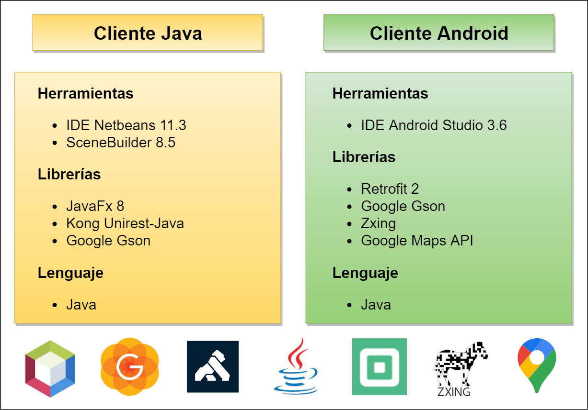
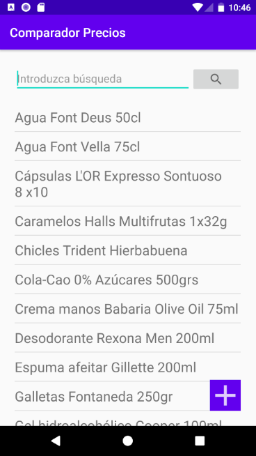
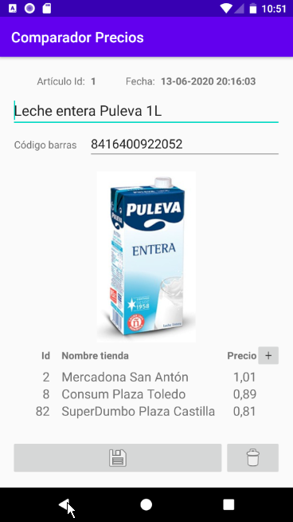
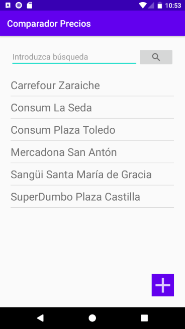
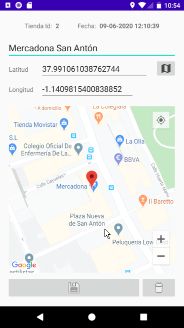
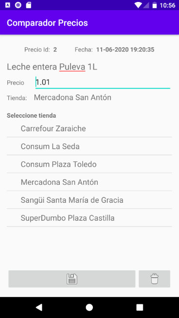
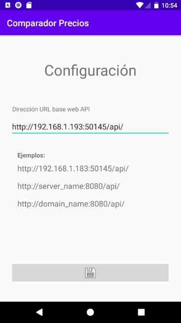

# ComparadorPrecios_Android

Aplicación **Android** que interactuar con la **Web API ComparadorPrecios**.

## Introducción

El proyecto desarrollado pretende ser sobre todo una prueba de concepto de un sistema que consiste en lo siguiente:

- Un servicio web **API RESTful** en un servidor que responde a peticiones de clientes y que almacena sus datos en una base de datos PostgreSQL [(Enlace GitHub)](https://github.com/sbarquero/ComparadorPrecios_WebAPI).
- Una **aplicación cliente multiplataforma** desarrollada en **Java** y que consume los servicios proporcionados por la web API [(Enlace GitHub)](https://github.com/sbarquero/ComparadorPrecios_Java).
-  Una **aplicación cliente para Android** que consume los servicios de la web API (Este proyecto). 

## Características

Se han empleado las siguientes herramientas y librerías:

- IDE **Android Studio 3.6**
- **Retrofit 2**
- **Google Gson**
- **Zxing**
- **Google Maps API**

- Está implementada la **internacionalización** (**i18n**)

## Puesta en marcha

Abrir proyecto con el **Android Studio 3.6** y ejecutar o generar el ejecutable `.apk`

## Capturas de pantalla

### Configuración

     